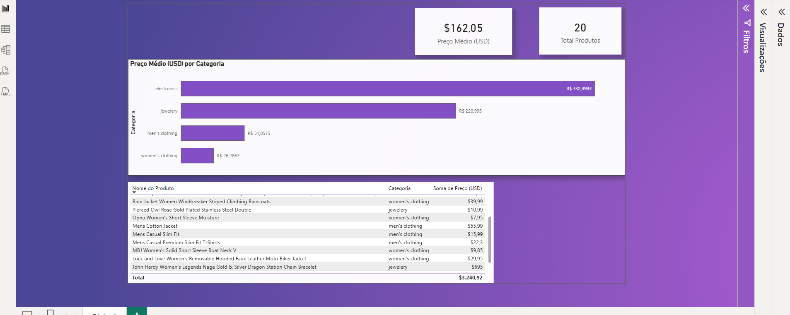

# 📊 Projeto End-to-End: Pipeline ETL em Python & Dashboard Interativo no Power BI

## 📌 Visão Geral do Projeto
Este projeto demonstra a construção de uma solução completa de inteligência de dados (End-to-End). O objetivo foi simular um cenário real de mercado no setor de e-commerce, cobrindo desde a extração automatizada de dados brutos via API, passando pelo tratamento e engenharia de dados em Python, até a modelagem analítica e visualização estratégica no Power BI.

## 🏗️ Arquitetura da Solução
O projeto foi dividido em duas grandes camadas:
1. **Engenharia de Dados (ETL):** Script em Python que extrai dados em formato JSON, realiza o parsing e a limpeza das estruturas e exporta um arquivo otimizado para o cenário regional.
2. **Análise de Dados (BI):** Ingestão do arquivo no Power BI, tratamento avançado de anomalias de tipos de dados locais via Power Query, modelagem com DAX e criação de um dashboard interativo para tomada de decisão.

---

## 🛠️ Tecnologias e Ferramentas Utilizadas
- **Python 3:** Lógica principal de programação.
- **Requests:** Consumo e requisição de dados de API de Sandbox.
- **Pandas:** Engenharia, transformação de JSON para estrutura tabular e tratamento de encoding.
- **Power Query (M):** Normalização de formatos regionais de moedas e numerações decimais.
- **DAX (Data Analysis Expressions):** Criação de métricas de negócios dinâmicas.
- **Power BI Desktop:** Modelagem dimensional e design de interface (Storytelling Visual).

---

## 🚀 Desenvolvimento Passo a Passo

### Etapa 1: O Pipeline ETL (Python)
* **Extract:** O script se conecta a um endpoint de e-commerce e captura dados brutos estruturados em JSON.
* **Transform:** Utilizando loops e dicionários, o robô isola apenas as chaves essenciais para o negócio (`title`, `category`, `price`). Os dados são convertidos em um `pd.DataFrame`.
* **Load (Otimizado):** Para evitar quebras comuns no Excel e Power BI em português, o arquivo foi salvo aplicando a codificação `utf-8-sig` (garantindo acentuação e cedilhas perfeitas) e delimitador de ponto e vírgula (`sep=';'`).

### Etapa 2: Data Cleaning e Modelagem (Power BI)
* **Tratamento de Anomalias Reais:** Durante a ingestão, foi identificada uma divergência regional onde o ponto americano de centavos foi interpretado como separador de milhar. A correção foi realizada via Power Query, convertendo a coluna temporariamente em Texto, aplicando a substituição de `.` por `,` e tipando novamente como Número Decimal.
* **Inteligência com DAX:** Criação de medidas dinâmicas para garantir performance no relatório:
```dax
Total Produtos = COUNTROWS('relatorio_precos_ecommerce')
Preço Médio (USD) = AVERAGE('relatorio_precos_ecommerce'[Preço (USD)])
```
 
